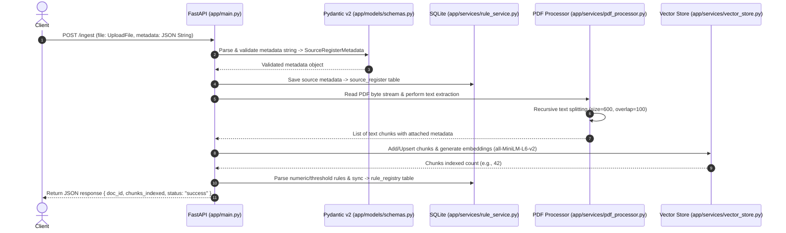

# Data Ingestion Pipeline & Container Infrastructure Architecture Guide

## 1. System Overview

This system is the **Data Ingestion Pipeline** for an AI-Powered University Student Services Assistant. Its primary purpose is to process university academic regulations, ordinances, policy documents, and administrative guidelines in PDF format. 

Upon receiving a document, the pipeline:
1. Validates and catalogs document metadata in a relational database (**SQLite**).
2. Extracts raw text from the PDF and splits it into semantic chunks (~600 characters with 100 character overlap).
3. Enriches each text chunk with document metadata.
4. Generates dense vector embeddings using **HuggingFace `sentence-transformers/all-MiniLM-L6-v2`** and indexes them into a persistent vector database (**ChromaDB**).
5. Automatically extracts numeric and policy rules (such as minimum CGPA, attendance thresholds, credit requirements) into a structured **Rule Registry** in SQLite.

---

## 2. Directory & Module Structure

```
c:\Users\Vishnu\Documents\hcl\
├── app/
│   ├── __init__.py          # Package initialization
│   ├── main.py              # FastAPI application entrypoint & API router
│   ├── config.py            # Environment configuration settings & paths
│   ├── database.py          # SQLite database connection & schema initialization
│   ├── models/
│   │   ├── __init__.py
│   │   └── schemas.py       # Pydantic v2 validation models & response contracts
│   └── services/
│       ├── __init__.py
│       ├── pdf_processor.py # PDF text extraction and recursive text splitting
│       ├── vector_store.py  # ChromaDB persistent client & sentence-transformers embedding wrapper
│       └── rule_service.py  # SQLite CRUD for source_register & rule_registry
├── data/                    # Persistent host directory mounted into Docker container
│   ├── university.db        # SQLite database file
│   └── chromadb/            # ChromaDB vector index files
├── Dockerfile               # Container build instructions with pre-downloaded model
├── docker-compose.yml       # Container orchestration service definition
└── requirements.txt         # Dependencies list
```

---

## 3. Databases & Schema Architecture

### A. SQLite Relational Database (`./data/university.db`)

#### 1. `source_register` Table
Catalog of all ingested documents to track provenance, authority level, and active validity periods.

| Column | Data Type | Constraints | Description |
| :--- | :--- | :--- | :--- |
| `doc_id` | TEXT | PRIMARY KEY | Unique identifier for the document (e.g., `ACAD-REG-2024`) |
| `title` | TEXT | NOT NULL | Human-readable title of document |
| `issuer` | TEXT | NULLABLE | Issuing university authority or committee |
| `authority_level` | INTEGER | DEFAULT 1 | Priority ranking from 1 (lowest) to 5 (highest governance) |
| `doc_type` | TEXT | NULLABLE | Document classification (e.g., Policy, Ordinance, Guidelines) |
| `version` | TEXT | DEFAULT '1.0'| Version number |
| `effective_from` | TEXT | NULLABLE | Start date of document validity (ISO `YYYY-MM-DD`) |
| `effective_to` | TEXT | NULLABLE | Expiration date of document validity (ISO `YYYY-MM-DD`) |
| `supersedes` | TEXT | NULLABLE | `doc_id` of previous regulation replaced by this document |
| `scope_programmes`| TEXT | NULLABLE | Target programmes (e.g., `B.Tech, M.Tech`) |
| `scope_batches` | TEXT | NULLABLE | Target student batches (e.g., `2022-2026`) |
| `provenance` | TEXT | NULLABLE | Source URI, file path, or origin description |
| `retrieved_on` | TEXT | NULLABLE | Timestamp of document retrieval |
| `synthetic` | INTEGER | DEFAULT 0 | `1` if test/synthetic data, `0` if official document |

#### 2. `rule_registry` Table
Structured store for machine-evaluable rules extracted from policy texts.

| Column | Data Type | Constraints | Description |
| :--- | :--- | :--- | :--- |
| `rule_id` | TEXT | PRIMARY KEY | Unique identifier (e.g., `RULE-ACAD-REG-2024-1`) |
| `description` | TEXT | NULLABLE | Textual description of the rule |
| `parameter` | TEXT | NULLABLE | Metric evaluated (e.g., `cgpa`, `attendance`, `credits`) |
| `operator` | TEXT | NULLABLE | Relational operator (e.g., `>=`, `<=`, `==`, `<`) |
| `value` | TEXT | NULLABLE | Target threshold value (e.g., `7.5`, `75%`, `160`) |
| `scope_programmes`| TEXT | NULLABLE | Programme applicability |
| `scope_batches` | TEXT | NULLABLE | Batch applicability |
| `effective_from` | TEXT | NULLABLE | Rule start date |
| `effective_to` | TEXT | NULLABLE | Rule end date |
| `source_doc_id` | TEXT | Foreign Key | Originating document ID |
| `source_section` | TEXT | NULLABLE | Originating chunk or section reference |

---

### B. Persistent Vector Store (ChromaDB `./data/chromadb`)

- **Collection Name**: `university_docs`
- **Embedding Model**: `sentence-transformers/all-MiniLM-L6-v2` (384-dimensional dense vectors)
- **Distance Metric**: Cosine distance (`hnsw:space: cosine`)
- **Metadata Attached per Chunk**:
  - `doc_id`, `title`, `authority_level`, `effective_from`, `effective_to`, `supersedes`, `scope_programmes`, `scope_batches`, `chunk_index`, `total_chunks`, `chunk_id`

---

## 4. End-to-End Data Ingestion Flow (`POST /ingest`)



---

## 5. Module & Function Reference

### 1. `app/config.py`
- **Purpose**: Centralizes configuration settings (file paths, chunking parameters, embedding model name, Ollama endpoint).
- **Mechanism**: Imports `BaseSettings` from `pydantic_settings` with a graceful fallback to a standard Python class if optional packages are missing during local CLI checks.

### 2. `app/database.py`
- **`get_db_connection()`**: Opens SQLite connection to `./data/university.db` with thread safety enabled and `sqlite3.Row` factory enabled.
- **`init_db()`**: Runs `CREATE TABLE IF NOT EXISTS` DDL statements for `rule_registry` and `source_register`.
- **`get_db()`**: FastAPI dependency generator yielding database connections per HTTP request.

### 3. `app/models/schemas.py`
- **`SourceRegisterMetadata`**: Pydantic v2 model enforcing constraints on `doc_id`, `authority_level` (constrained 1-5 via `ge=1, le=5`), and validity dates.
- **`RuleItem`**: Model for rule entries to insert into `rule_registry`.
- **`IngestResponse`**: Return schema for `POST /ingest` (`doc_id`, `chunks_indexed`, `status`, `rules_extracted`).
- **`HealthResponse`**: Return schema for `GET /health`.

### 4. `app/services/pdf_processor.py`
- **`extract_text_from_pdf(pdf_bytes)`**: Converts uploaded binary byte stream into a `io.BytesIO` object and extracts raw text per page using `pypdf.PdfReader`.
- **`recursive_split_text(text)`**: Implements a recursive text splitter algorithm. Attempts splitting by paragraph (`\n\n`), newline (`\n`), sentence (`. `), space (` `), and character level to maintain semantic boundary integrity while respecting target chunk size (600) and overlap (100).
- **`process_pdf(pdf_bytes, metadata)`**: Orchestrates text extraction and chunking, cleans metadata values into ChromaDB-compatible primitives (converting `None` to `""`), and returns structured chunk dictionaries.

### 5. `app/services/vector_store.py`
- **`VectorStoreService.__init__()`**: Instantiates `chromadb.PersistentClient` pointing to `./data/chromadb` and initializes `SentenceTransformerEmbeddingFunction("sentence-transformers/all-MiniLM-L6-v2")`.
- **`add_chunks(chunks)`**: Uses ChromaDB `.upsert()` to compute 384-dim embeddings and store document texts, IDs, and metadata. Overwrites existing IDs on document re-ingestion.
- **`is_healthy()`**: Executes `.heartbeat()` on ChromaDB client for system diagnostics.

### 6. `app/services/rule_service.py`
- **`save_source_metadata(conn, metadata)`**: Executes `INSERT OR REPLACE INTO source_register`.
- **`save_rule(conn, rule)`**: Executes `INSERT OR REPLACE INTO rule_registry`.
- **`sync_rules(conn, rules)`**: Batch inserts or updates rules.
- **`extract_rules_from_chunks(conn, metadata, chunks, structured_rules)`**: Scans text chunks for numeric threshold patterns (e.g. `CGPA >= 7.5`, `attendance >= 75%`, `credits >= 160`) using regular expressions or structured rules, constructs `RuleItem` instances, and saves them to `rule_registry`.

### 7. `app/main.py`
- **`lifespan(app)`**: Startup lifecycle hook that executes `init_db()` and initializes `VectorStoreService` before serving HTTP traffic.
- **`health_check()`**: GET endpoint probing SQLite connectivity (`SELECT 1`) and ChromaDB heartbeat.
- **`ingest_document()`**: Multipart POST handler executing document ingestion workflow.

---

## 6. Docker & Containerization Details

- **`Dockerfile`**:
  - Base: `python:3.11-slim`
  - Installs requirements and pre-runs:
    `RUN python -c "from sentence_transformers import SentenceTransformer; SentenceTransformer('sentence-transformers/all-MiniLM-L6-v2')"`
    This caches HuggingFace model weights inside the container layer so container startup requires zero internet downloads.
- **`docker-compose.yml`**:
  - Service `api` listening on port `8000`.
  - Host directory mapping: `./data:/app/data` to ensure SQLite and ChromaDB persist across container restarts.
  - Resolves `host.docker.internal` via `extra_hosts` to connect with local Ollama LLM services on the host.
