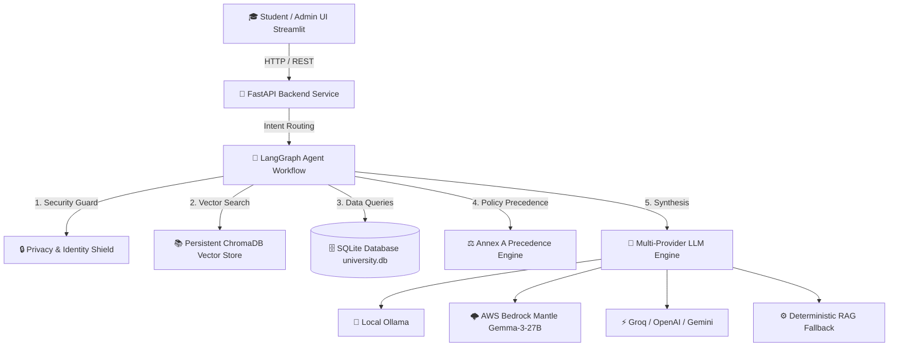
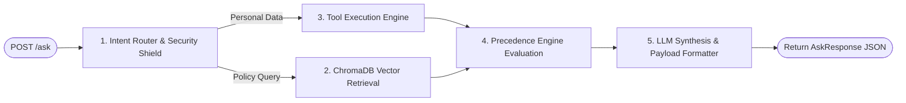

# 🎓 University Student Services Assistant - Comprehensive Project Overview

> **Version:** 1.0.0  
> **Architecture:** RAG + Deterministic Tool Engine + LangGraph Orchestration  
> **Deployment:** Docker & Docker Compose  

---

## 📌 1. Project Objective & Scope

The **University Student Services Assistant** is an enterprise-grade AI system designed to answer student queries regarding academic regulations, exam eligibility, course attendance, grades, CGPA, and university policies. 

It combines **Retrieval-Augmented Generation (RAG)** over official university PDF policy documents with **deterministic relational calculations** over student database records (attendance, marks, backlogs), enforced by a strict **Annex A Policy Precedence Engine** and **Cross-Student Security Shield**.

---

## 🏗️ 2. Core Architecture & Technology Stack



### Stack Components:
1. **Frontend UI**: Streamlit web application (`ui/app.py` running on `http://localhost:8501`).
2. **Backend API**: FastAPI with Uvicorn (`app/main.py` running on `http://localhost:8000`).
3. **Agent Orchestrator**: LangGraph `StateGraph` workflow (`app/agent/workflow.py`, `nodes.py`, `tools.py`).
4. **Vector Database**: Persistent ChromaDB (`data/chromadb`) using HuggingFace `sentence-transformers/all-MiniLM-L6-v2` 384-dimensional embeddings.
5. **Relational Database**: SQLite (`data/university.db`) storing 7 relational tables.
6. **Multi-Provider LLM Engine**: Supports AWS Bedrock Mantle (`google.gemma-3-27b-it`), Local Ollama (`llama3.1:8b`), Groq, OpenAI, Gemini, and a deterministic RAG fallback.

---

## 🗄️ 3. Relational Database Schema (SQLite)

The SQLite database (`university.db`) contains 7 core tables:

| Table Name | Description | Key Attributes |
| :--- | :--- | :--- |
| `students` | Annex C student dataset | `student_id` (PK), `full_name`, `programme`, `batch_year`, `cgpa`, `active_backlogs`, `password` |
| `courses` | Course catalog | `course_code` (PK), `course_name`, `programme`, `semester`, `credits` |
| `attendance` | Class attendance tracking | `student_id`, `course_code` (Composite PK), `classes_held`, `classes_attended` |
| `results` | Examination marks & grades | `student_id`, `course_code`, `internal_marks`, `external_marks`, `result` |
| `rule_registry` | Extracted numerical policy rules | `rule_id` (PK), `parameter`, `operator`, `value`, `source_doc_id` |
| `source_register` | Catalog of ingested PDFs | `doc_id` (PK), `title`, `issuer`, `authority_level`, `version`, `effective_from`, `supersedes` |
| `audit_log` | Persistent Q&A audit history | `trace_id` (PK), `question`, `student_id`, `as_of_date`, `answer_type`, `answer`, `timestamp`, `raw_payload` |

---

## 🤖 4. LangGraph Agent Workflow Nodes



1. **Node 1: Intent Router & Security Shield**
   - Classifies intent (`personal_data`, `personal_eligibility`, `policy_fact`, `procedure`, `not_found`, `unauthorized_refused`).
   - Blocks Student A from accessing Student B's academic data.
   - Enforces login requirements for personal queries (`"what is my branch name?"` requires student authentication).

2. **Node 2: Vector Retrieval & Annex A Precedence Engine**
   - Retrieves Top-K similar chunks from persistent ChromaDB vector store.
   - Filters out superseded, expired, or non-applicable document versions.
   - Flags active policy conflicts.

3. **Node 3: Deterministic Tool Execution Engine**
   - Calculates exact attendance percentages (`tool_get_attendance`).
   - Evaluates exam eligibility against thresholds (`tool_check_exam_eligibility`).
   - Fetches academic profile metrics (`tool_get_student_profile`).

4. **Node 4: Output Synthesis & LLM Engine**
   - Prompts the active LLM provider (Ollama / AWS Bedrock Mantle / Groq / OpenAI) grounded on retrieved chunks & tool outputs.
   - Fallback to deterministic synthesis if LLM endpoints are unreachable.

---

## ⚖️ 5. Annex A Policy Precedence Engine

When document rules conflict, the system resolves them deterministically through a **5-step precedence hierarchy**:

1. **Authority Level Ranking (1 to 5)**: Level 1 (Board/Senate) overrides Level 2 (Dean), Level 3 (Department), etc.
2. **Date Validity Scope**: Filters out policies where `as_of_date < effective_from` or `as_of_date > effective_to`.
3. **Explicit Supersession Tracking**: If Document B lists `supersedes: Document A`, Document A is marked inactive.
4. **Version Recency**: Higher version numbers (`v3.1` > `v2.0`) take precedence for equal authority levels.
5. **Programme Scope Specialization**: Programme-specific rules override general university-wide regulations.

---

## 🔒 6. Security & Audit Trace System

- **Cross-Student Security Guard**: Ensures students can only view their own records (`X-Student-Id` header check).
- **Persistent Q&A Audit Logging**: Every query generates a unique 8-character `trace_id` saved in SQLite `audit_log` and accessible via `GET /audit/{trace_id}` or `GET /audit-logs`.
- **Admin Authentication**: Admin Dashboard operations (`/ingest`, `/load-students`) are protected by admin credentials (`admin` / `admin123`).

---

## 🔌 7. Section 6 API Contract Endpoints

| Endpoint | Method | Purpose |
| :--- | :--- | :--- |
| `POST /ask` | `POST` | Core student Q&A endpoint returning grounded answers, citations, executed tools, applied rules, and trace ID. |
| `POST /ingest` | `POST` | Multipart PDF upload + text extraction + vector indexing + rule registry sync. |
| `GET /sources` | `GET` | Catalog of ingested documents stored in `source_register`. |
| `POST /load-students` | `POST` | Ingest judge test dataset JSON into SQLite (`students`, `courses`, `attendance`, `results`). |
| `POST /auth/login` | `POST` | Authenticates student password (`fullname+programme`). |
| `POST /auth/admin-login` | `POST` | Authenticates admin user credentials. |
| `GET /audit-logs` | `GET` | List all asked questions, timestamps, student IDs, and audit records. |
| `GET /audit/{trace_id}` | `GET` | Retrieve specific Q&A audit record by trace ID. |
| `GET /health` | `GET` | Infrastructure diagnostic check for SQLite and ChromaDB vector store. |

---

## 🚀 8. Running the Application with Docker

```bash
# 1. Start full multi-container stack (FastAPI Backend + Streamlit UI)
docker-compose up -d

# 2. View running containers
docker ps

# 3. Access Web Interfaces
# Student & Admin Portal: http://localhost:8501
# FastAPI Swagger Docs:   http://localhost:8000/docs
```

---

*Documentation compiled automatically for University Assistant Repository.*
