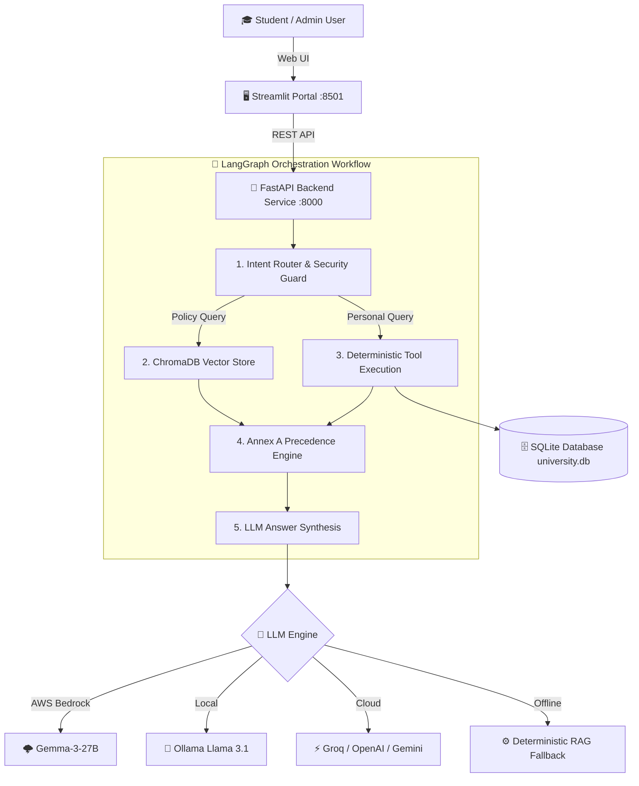
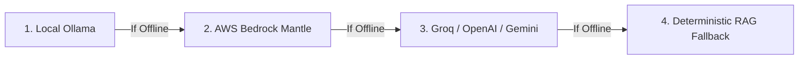
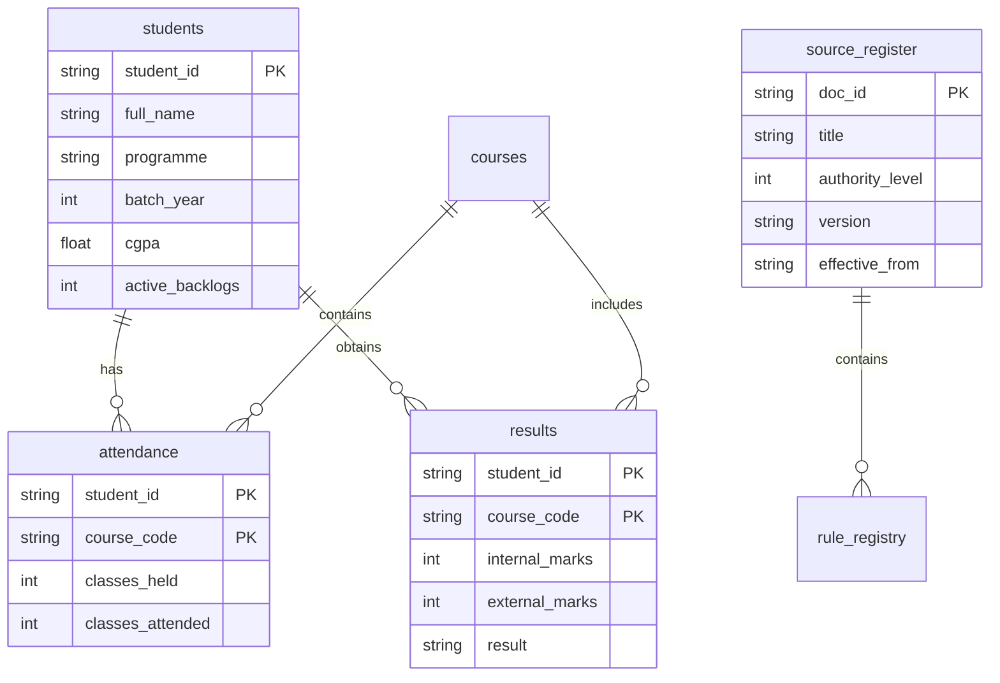

<div align="center">

# 🎓 University AI Student Services Assistant
### Enterprise RAG + Deterministic Tool Engine + LangGraph Agent Orchestrator

[](https://www.python.org/)
[](https://fastapi.tiangolo.com/)
[](https://streamlit.io/)
[](https://www.trychroma.com/)
[](https://python.langchain.com/)
[](https://www.docker.com/)

**Production-ready Data Ingestion Pipeline, Vector Retrieval Engine, Annex A Precedence Resolver, and Interactive Streamlit Web Portal.**  
*Built for the HCLTech Future Ready AI Engineer Code Catalyst Competition.*

[Features](#-key-features) • [Architecture](#-architecture) • [Quickstart](#-quickstart--deployment) • [API Reference](#-api-reference) • [LLM Engine](#-multi-provider-llm-engine) • [Security](#-security--privacy-shield)

---
</div>

## 🌟 Key Features

- 🧠 **Hybrid RAG + Deterministic Tool Calculation**: Seamlessly combines semantic vector retrieval over university PDFs with exact SQLite mathematical tool calculations for attendance, marks, and CGPA.
- ⚖️ **Annex A Policy Precedence Resolver**: Deterministically resolves conflicts between regulation versions, authority levels (Level 1 Senate > Level 2 Dean), effective dates, and programme specializations.
- 🔒 **Cross-Student Security Shield**: Prevents unauthorized access—Student A (`S1001`) is strictly blocked from accessing Student B's (`S1002`) academic records.
- 🌩️ **Multi-Provider LLM Engine**: Native support for **AWS Bedrock Mantle (`google.gemma-3-27b-it`)**, Local Ollama (`llama3.1:8b`), Groq, OpenAI (`gpt-4o-mini`), and Google Gemini, backed by an automatic deterministic RAG fallback.
- 🔍 **Full Audit Trace & Persistence**: Every query generates a unique `trace_id` logged in SQLite table `audit_log` with step-by-step execution details.
- 🐳 **One-Command Docker Stack**: Complete containerized setup for both FastAPI API Server (`:8000`) and Streamlit Portal (`:8501`).

---

## 🏛 Architecture



---

## 🚀 Quickstart & Deployment

### Prerequisites
- [Docker](https://www.docker.com/) & Docker Compose
- Git

### One-Command Launch (Docker)

```bash
# Clone the repository
git clone https://github.com/electrogamerzop12-hub/HCL-code-catalyst.git
cd HCL-code-catalyst

# Launch full stack using Docker Compose
docker-compose up -d
```

### Access Services

| Service | URL | Description |
| :--- | :--- | :--- |
| 🎓 **Streamlit Portal** | [`http://localhost:8501`](http://localhost:8501) | Interactive Student & Admin Web UI |
| 🛠️ **FastAPI Swagger API** | [`http://localhost:8000/docs`](http://localhost:8000/docs) | Interactive API documentation |
| 💚 **Health Diagnostics** | [`http://localhost:8000/health`](http://localhost:8000/health) | System health probe |

---

## 🔐 Credentials & Identity Access

### Student Login Credentials (Annex C Dataset)

| Student ID | Student Name | Programme | Password (`fullname+programme`) |
| :--- | :--- | :--- | :--- |
| `S1001` | Aarav Sharma | B.Tech CSE | `aaravsharmabtechcse` |
| `S1002` | Ananya Patel | B.Tech CSE | `ananyapatelbtechcse` |
| `S1003` | Rohan Gupta | B.Tech ECE | `rohanguptabtechece` |

### Administrative Credentials
- **Admin Username**: `admin`
- **Admin Password**: `admin123`

---

## 🧠 Multi-Provider LLM Engine

The assistant automatically routes queries through your preferred LLM provider in exact order:



### Environment Configuration (`.env`)

```env
# AWS Bedrock Mantle (Google Gemma-3-27B)
BEDROCK_MANTLE_API_KEY=your_bedrock_mantle_key
BEDROCK_MANTLE_BASE_URL=https://bedrock-mantle.ap-south-1.api.aws/v1
BEDROCK_MANTLE_MODEL=google.gemma-3-27b-it
AWS_DEFAULT_REGION=ap-south-1

# Local Ollama Endpoint
OLLAMA_BASE_URL=http://host.docker.internal:11434
```

---

## 📡 API Reference & Contracts

### 1. Ask Question (`POST /ask`)
Executes RAG vector retrieval, deterministic database tool calculations, and LLM synthesis.

```bash
curl -X POST "http://localhost:8000/ask" \
  -H "Content-Type: application/json" \
  -H "X-Student-Id: S1001" \
  -d '{
    "question": "Am I eligible to appear in the end semester exam for CS201?",
    "as_of_date": "2026-10-06"
  }'
```

**Response Payload (`200 OK`)**:
```json
{
  "trace_id": "aa46162a",
  "answer": "Yes, you are eligible to appear in the end-semester exam for CS201.",
  "answer_type": "calculated",
  "citations": [
    {
      "doc_id": "ACAD-REG-2024",
      "title": "Academic Regulations",
      "section": "7.2",
      "version": "3.1"
    }
  ],
  "tools_invoked": [
    {
      "tool": "get_attendance",
      "input": {"student_id": "S1001", "course_code": "CS201"},
      "output": {"classes_held": 40, "classes_attended": 35, "attendance_pct": 87.5}
    },
    {
      "tool": "check_exam_eligibility",
      "input": {"student_id": "S1001", "course_code": "CS201", "threshold": "75%"},
      "output": {"result": "ELIGIBLE", "attendance_pct": 87.5}
    }
  ],
  "applied_rules": [
    {
      "rule_id": "ATT-MIN-01",
      "parameter": "min_attendance_pct",
      "operator": ">=",
      "value": "75.0%",
      "source_doc_id": "ACAD-REG-2024"
    }
  ],
  "explanation": "Your attendance in CS201 is 87.5%, which is above the 75% minimum required threshold.",
  "as_of_date": "2026-10-06"
}
```

### 2. PDF Document Ingestion (`POST /ingest`)
Extracts text from regulation PDFs, recursively chunks content (~600 chars), generates embeddings, and indexes into ChromaDB.

```bash
curl -X POST "http://localhost:8000/ingest" \
  -F "file=@academic_regulations.pdf" \
  -F 'metadata={"doc_id":"ACAD-REG-2024","title":"Academic Regulations for B.Tech","issuer":"Dean Academics","authority_level":1,"doc_type":"regulation","version":"3.1","effective_from":"2024-07-01","scope_programmes":"B.Tech CSE","scope_batches":"2023+","provenance":"University Portal","synthetic":0}'
```

### 3. Load Student Test Dataset (`POST /load-students`)
Loads judge test student dataset into SQLite (`students`, `courses`, `attendance`, `results`).

```bash
curl -X POST "http://localhost:8000/load-students" \
  -H "Content-Type: application/json" \
  -d @data/sample_students.json
```

---

## 🗄️ Database Schema

SQLite relational database (`university.db`) contains 7 core tables:



---

## 🧪 Testing & Validation

Run local constraint validation script:

```bash
python scripts/validate_students.py
```

---

## 📄 License & Attribution

Built for the **HCLTech Future Ready AI Engineer Hackathon**.  
Designed & Implemented by **Code Catalyst**.
